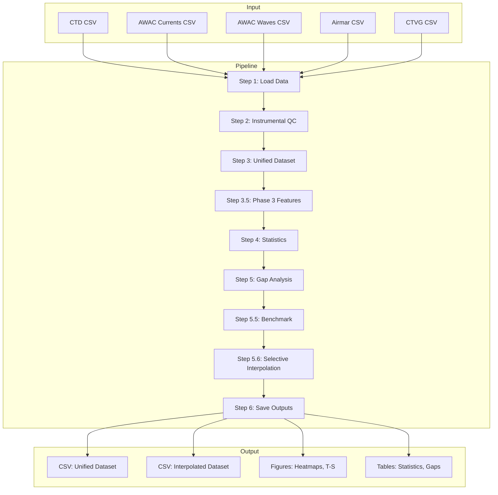

# OBSEA Multivariate Data Analysis Pipeline
## Scientific Documentation for Publication-Ready Research

**Script:** [lup_data_obsea_analysis.py](file:///home/uripratt/Documents/PhD/OBSEA_data/CTD/scripts/lup_data_obsea_analysis.py)  
**Lines of Code:** 2,460  
**Functions:** 72  
**Domain:** Physical Oceanography | Time Series | Gap Filling

---

## 1. Executive Summary

This pipeline performs **end-to-end processing** of multivariate oceanographic time series from the OBSEA cabled observatory (Vilanova i la Geltrú, NW Mediterranean). It integrates:

- **CTD** (T, S, P, conductivity, sound velocity)
- **AWAC Currents** (U, V, speed, direction)
- **AWAC Waves** (Hs, Tp, direction)
- **Airmar/CTVG** (wind, atmospheric pressure, humidity)

The pipeline produces a **unified, QC'd, gap-filled multivariate dataset** suitable for ML/DL modeling and scientific analysis.

---

## 2. Architecture Overview



---

## 3. Module Breakdown

### 3.1 Configuration (Lines 46–152)

| Parameter | Description |
|-----------|-------------|
| `CONFIG['data_paths']` | Paths to 5 instrument CSVs |
| `CONFIG['physical_ranges']` | QARTOD-style fail/suspect bounds per variable |
| `CONFIG['gradient_thresholds']` | Max Δvar/30min for spike detection |
| `GAP_CATEGORIES` | 6 categories: micro (<1h) → gigant (>60d) |
| `INTERPOLATION_CONFIG` | Boolean controls + method assignment per gap category |

**Scientific Note:** Physical ranges are tuned for NW Mediterranean climatology (T: 10–28°C, S: 36–39.5 PSU).

---

### 3.2 Data Loading (Lines 154–224)

| Function | Purpose |
|----------|---------|
| `load_instrument_data()` | Parse CSV, set TIME index, extract relevant variables |
| `load_all_data()` | Load all 5 instruments with progress tracking |

**Output:** `Dict[str, pd.DataFrame]` with instrument-keyed DataFrames.

---

### 3.3 Quality Control (Lines 231–366)

Implements **QARTOD-style** instrumental QC:

| Function | Check Type | Flag Values |
|----------|------------|-------------|
| `range_check()` | Physical bounds | 1=good, 3=suspect, 4=fail |
| `spike_check()` | Rolling σ deviation | 3=spike detected |
| `gradient_check()` | Rate of change | 3=excessive gradient |
| `flatline_check()` | Repeated values | 3=stuck sensor |
| `apply_instrumental_qc()` | Combine all → `{VAR}_QC_INST` |

**Scientific Rigor:** Uses 3σ threshold for spikes, configurable per-variable gradient limits.

---

### 3.4 Phase 3: Mathematical Preprocessing (Lines 378–859)

#### 3.4.1 Normalization

| Function | Method | Use Case |
|----------|--------|----------|
| `robust_scale()` | IQR-based (P5–P95) | Outlier-resistant scaling |
| `log_transform()` | log1p | Skewed variables (Hs, pressure) |
| `compute_anomaly()` | T' = T - T̄(doy, hr) | Remove seasonal/diurnal cycles |

#### 3.4.2 Stationarization

| Function | Method | Use Case |
|----------|--------|----------|
| `stl_decompose()` | STL (LOESS) | Extract trend + seasonal + residual |
| `apply_differencing()` | Δⁿ series | AR/VAR model preparation |

#### 3.4.3 Oceanographic Features (TEOS-10)

| Function | Output | Physical Meaning |
|----------|--------|------------------|
| `compute_density_sigma()` | SIGMA0 | σ_θ potential density (kg/m³) |
| `compute_brunt_vaisala()` | N2 | Stratification strength (s⁻²) |
| `decompose_wind_uv()` | WIND_U, WIND_V | Zonal/meridional components |
| `compute_wind_stress()` | WIND_STRESS | τ = ρCdU² (Pa) |
| `compute_wave_energy()` | WAVE_ENERGY | Flux (kW/m) |
| `compute_rms_currents()` | CUR_RMS | √(U² + V²) |

**Dependencies:** Requires `gsw` (TEOS-10) for density calculations.

---

### 3.5 Resampling (Lines 867–917)

| Function | Method |
|----------|--------|
| `circular_mean()` | Vector mean for directions |
| `resample_variable()` | Physically-appropriate: median for periods, circular for angles |
| `resample_dataframe()` | Apply per-instrument |

**Scientific Note:** Directional variables use circular statistics to avoid 0°/360° discontinuity.

---

### 3.6 Multivariate Integration (Lines 924–989)

`create_unified_dataset()` merges all instruments into a single DataFrame:

| Prefix | Instrument |
|--------|------------|
| (none) | CTD |
| `CUR_` | AWAC Currents |
| `WAV_` | AWAC Waves |
| `AIR_` | Airmar |
| `LAND_` | CTVG |

**Output:** Regular 30-min grid covering full temporal extent.

---

### 3.7 Gap Analysis (Lines 996–1071)

| Function | Purpose |
|----------|---------|
| `classify_gap_duration()` | Map hours → category |
| `detect_gaps()` | Find gap start/end boundaries |
| `analyze_gaps()` | Return DataFrame of all gaps |
| `create_gap_summary()` | Aggregate by variable × category |

**Gap Categories:**

| Category | Duration | Recommended Method |
|----------|----------|-------------------|
| micro | <1h | time interpolation |
| short | 1–6h | VARMA |
| medium | 6h–3d | Bi-LSTM |
| long | 3–30d | Bi-LSTM |
| extended | 30–60d | (disabled) |
| gigant | >60d | (disabled) |

---

### 3.8 Interpolation Module (Lines 1078–1571)

#### Classical Methods

| Function | Method |
|----------|--------|
| `interpolate_linear()` | Linear |
| `interpolate_time()` | Time-weighted |
| `interpolate_spline()` | Cubic spline |
| `interpolate_polynomial()` | Polynomial (order 2) |

#### Multivariate Methods

| Function | Method | Description |
|----------|--------|-------------|
| `interpolate_var()` | VAR(p) | Vector Autoregression |
| `interpolate_varma()` | VARMA(p,q) | PyTorch-accelerated, CUDA support |
| `interpolate_bilstm()` | Bi-LSTM | Deep learning, bidirectional |

#### Selective Interpolation

`selective_interpolation()` applies **different methods per gap category** controlled by `INTERPOLATION_CONFIG`:

1. Reads boolean flags (`interpolate_micro`, etc.)
2. Applies assigned method per category
3. Caches Bi-LSTM models to avoid re-training
4. Tracks provenance: `interpolated_time`, `interpolated_varma`, `interpolated_bilstm`

---

### 3.9 Statistical Analysis (Lines 1714–1794)

| Function | Output |
|----------|--------|
| `compute_descriptive_stats()` | count, missing%, mean, std, percentiles, skew, kurtosis |
| `compute_correlation_matrix()` | Pearson or Spearman |
| `compute_acf_pacf()` | Autocorrelation for lag analysis |

---

### 3.10 Visualization (Lines 1801–2141)

| Function | Output |
|----------|--------|
| `plot_gap_heatmap()` | Year × variable availability |
| `plot_correlation_matrix()` | Heatmap |
| `plot_instrument_timeseries()` | Multi-panel per instrument |
| `plot_timeseries_with_gaps()` | Gaps as colored bands |
| `plot_gap_duration_histogram()` | Distribution analysis |
| `plot_ts_diagram()` | T-S with density isopycnals |

---

## 4. Pipeline Execution Flow

```
Step 1  → Load Data (5 instruments)
Step 2  → Instrumental QC (QARTOD-style flags)
Step 3  → Create Unified Dataset (30-min grid)
Step 3.5 → Phase 3 Features (σ_θ, N², τ, etc.)
Step 4  → Statistical Analysis
Step 5  → Gap Analysis & Profiling
Step 5.5 → Benchmark (RMSE comparison)
Step 5.6 → Selective Interpolation (config-based)
Step 6  → Save Outputs (CSV + figures)
```

---

## 5. Scalability & Reproducibility

### Strengths for Publication

| Aspect | Implementation |
|--------|---------------|
| **Configurability** | All parameters in `CONFIG` / `INTERPOLATION_CONFIG` |
| **Traceability** | `{VAR}_SOURCE` tracking for each interpolated point |
| **Physical Validation** | TEOS-10 for density, QARTOD for QC |
| **Method Hierarchy** | Simple → VARMA → Bi-LSTM by gap size |
| **GPU Acceleration** | CUDA support for VARMA and Bi-LSTM |

### Extensibility Points

1. **Add new instrument:** Add to `CONFIG['data_paths']` + `CONFIG['variables']`
2. **New interpolation method:** Add function + register in `selective_interpolation()`
3. **New derived feature:** Add to `add_derived_features()`

---

## 6. Dependencies

```
pandas, numpy, matplotlib, seaborn
scipy, statsmodels (STL)
torch (Bi-LSTM, VARMA)
gsw (TEOS-10 oceanography)
rich (console output)
```

---

## 7. Output Files

| File | Description |
|------|-------------|
| `OBSEA_multivariate_30min.csv` | Original unified dataset |
| `OBSEA_multivariate_30min_interpolated.csv` | Gap-filled dataset |
| `interpolation_tracking.csv` | Provenance of each point |
| `descriptive_statistics.csv` | Per-variable stats |
| `gap_summary.csv` | Gap counts by category |
| `figures/*.png` | All visualizations |
