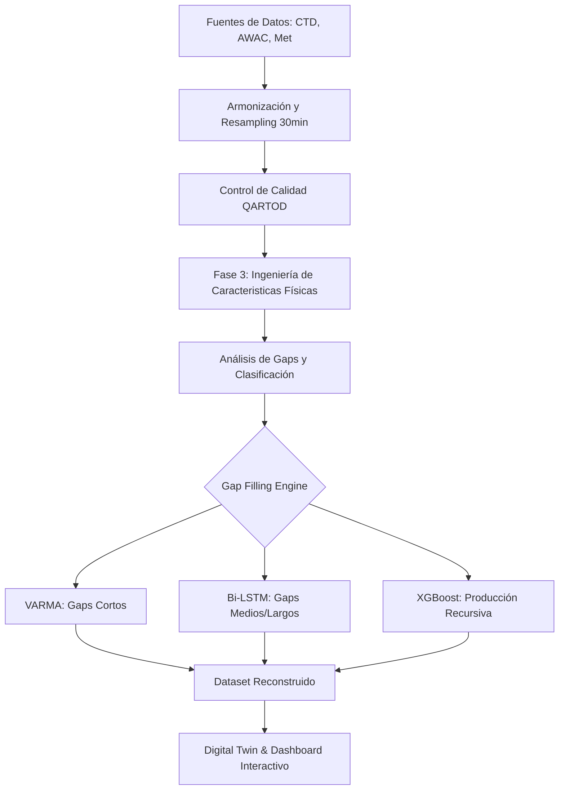

# Documentación Técnica Exhaustiva: Pipeline de Análisis Multivariado OBSEA
## Análisis Funcional y Justificación Científica para Tesis Doctoral

Este documento ofrece un desglose pormenorizado del sistema de procesamiento de datos OBSEA, detallando la lógica interna de cada módulo y función del código.

---

### 1. Sistema de Configuración Global (`CONFIG` & `INTERPOLATION_CONFIG`)
El comportamiento de toda la pipeline está gobernado por diccionarios centrales que permiten la reproducibilidad científica:
- **`CONFIG`**: Define las rutas de entrada, las variables por instrumento y los umbrales de QC.
- **`GAP_CATEGORIES`**: Establece la taxonomía temporal de las lagunas (de 1h a >60 días).
- **`INTERPOLATION_CONFIG`**: Activa o desactiva modelos específicos (XGBoost, Bi-LSTM, VARMA) para cada categoría de gap, permitiendo un control granular del coste computacional vs. precisión.

---

### 2. Módulo de Adquisición y Normalización Estructural
#### `load_all_data(config)`
- **Lógica**: Itera sobre los archivos CSV base, manejando diferentes formatos de fecha y nombres de columnas.
- **Sincronización**: Convierte las fechas a objetos `datetime` de Python y establece el índice temporal.

#### `resample_dataframe(df, instrument, target_freq)`
- **`circular_mean`**: Para variables angulares (direcciones), no se usa una media normal. Se descomponen en seno y coseno, se promedian y se vuelve a calcular el ángulo mediante `arctan2`, evitando el error de promediar 359° y 1° como 180° (el valor correcto es 0°).
- **Consolidación**: Se aplica la media aritmética a escalares y la peor bandera de calidad (MAX) a los flags de QC.

---

### 3. Módulo de Control de Calidad (QC) - Estándar QARTOD
La función `apply_instrumental_qc` ejecuta una batería de tests sobre cada variable:

1.  **`check_range`**: Compara cada dato con los límites teóricos del sensor y los límites físicos regionales (Mar Mediterráneo). Marca como `fail` (4) lo imposible y `suspect` (3) lo improbable.
2.  **`check_spikes`**: Utiliza una ventana móvil para calcular la desviación estándar local. Si la diferencia entre un punto y sus vecinos excede un umbral dinámico ($\lambda \cdot \sigma$), se identifica como ruido electrónico o biológico.
3.  **`check_gradient`**: Calcula la derivada temporal ($dx/dt$). Si el cambio entre dos medidas de 30 min es físicamente imposible, el dato se invalida.
4.  **`check_flatline`**: Detecta fallos de colgado del sensor buscando series de valores idénticos que persisten más allá de la varianza natural del instrumento.

---

### 4. Ingeniería de Características de Fase 3 (Physics-Informed)
La función `add_derived_features` es el núcleo de la "inteligencia física" del proyecto:

1.  **Cálculos TEOS-10 (`SIGMA0`)**: Implementa la ecuación de estado del agua de mar para derivar densidad potencial a partir de Temperatura, Salinidad y Presión.
2.  **Estratificación (`N2`)**: Estima la estabilidad de la columna de agua usando gradientes temporales como proxy de los verticales, permitiendo que los modelos de IA entiendan la estructura de la masa de agua.
3.  **Forzamiento Meteorológico**:
    - **`decompose_wind_uv`**: Descompone el vector viento en componentes zonales y meridionales.
    - **`compute_wind_stress`**: Calcula el esfuerzo cortante del viento en la superficie, motor principal de las corrientes superficiales.
4.  **Anomalías Climatológicas**: Eliminación de ciclos estacionales y diurnos para aislar las señales anómalas: $x'_i = x_i - \bar{x}(\text{doy}, \text{hour})$.
5.  **Análisis de Estacionariedad (ADF Test)**: Aplicación del test de Augmented Dickey-Fuller para determinar estadísticamente si las series presentan una raíz unitaria (tendencia estocástica) o si son estacionarias, requisito previo para modelos de predicción lineal.
6.  **Descomposición STL y Tendencias a Largo Plazo**:
    - Se separa el componente de tendencia ($Trend$), estacional ($Seasonal$) y residuo ($Resid$).
    - Se realiza una regresión lineal sobre el componente de tendencia para cuantificar el cambio anual (ej: incremento de temperatura en °C/año), proporcionando un valor climático directo para la tesis.
7.  **Balance Energético**: Calcula el flujo de energía de las olas (`WAVE_ENERGY`), proporcionando contexto sobre eventos de tormenta.
8.  **Anomalías**: Resta el ciclo medio histórico (`compute_anomaly`) para que la IA aprenda el "ruido físico" y los eventos extremos, no solo la estacionalidad obvia.

---

### 5. Análisis de Gaps y Benchmarking Científico
#### `analyze_gaps(df)`
- Detecta bloques de NaNs y les asigna una de las 6 categorías de duración. Esto permite generar estadísticas de persistencia de fallos en el observatorio.

#### `benchmark_gap_filling(df, test_variable)`
- **Validación Cruzada por Bloques**: Esconde datos reales y prueba todos los modelos activados.
- **Métricas**: Calcula **RMSE** (error cuadrático), **MAE** (error absoluto), **R²** (correlación) y **Precisión al 5%**.
- **Visualización**: Genera `benchmark_results.png` para justificar gráficamente por qué se elige un modelo sobre otro en la tesis.

---

### 6. Arquitectura de los Modelos de Imputación de IA
#### A. Bi-LSTM Multivariado (`MultivariateLSTMImputer`)
- **Arquitectura**: Dos capas de LSTM que procesan la serie hacia adelante y hacia atrás.
- **Mecanismo de Atención**: Pondera la importancia de cada paso previo (ej: las mareas de hace 12h pueden importar más que la de hace 1h).
- **Residual Training**: Se entrena para predecir la *anomalía*, sumando la climatología al final.
- **Blending**: Aplica una corrección lineal (`correction ramp`) en los bordes del gap para que la transición entre datos reales y simulados sea imperceptible.

#### B. XGBoost Bidireccional (`XGBoostImputer`)
- **Recursividad Optimizada**: El modelo predice un paso, actualiza sus propios "lags" y predice el siguiente. Hemos optimizado este bucle para que sea $O(n)$ pre-calculando las variables estáticas y exógenas.
- **Ensemble**: Se entrenan dos modelos (Forward y Backward) y se promedian sus resultados, cancelando sesgos temporales.

#### C. VARMA (`VARMAImputer`)
- **Multivariedad**: Utiliza la matriz de covarianza entre variables relacionadas (ej: Temperatura de aire y agua) para rellenar gaps cortos mediante relaciones lineales dinámicas. Acelerado por **CUDA** para procesamiento masivo.

---

### 7. Integración Final y Exportación de Resultados
La función `main` coordina el cierre:
- **`selective_interpolation`**: Orquestador principal que maneja la caché de modelos para no entrenar dos veces lo mismo.
- **Metadata Tracking**: Crea `interpolation_tracking.csv`, permitiendo saber exactamente qué método rellenó cada hueco, garantizando la **trazabilidad científica**.
- **Exportación**: Genera el dataset final enriquecido con variables físicas e imputado mediante IA avanzada.

---

### 8. Visualización Avanzada: El "Digital Twin" (Frontend)
Para democratizar el acceso a los datos procesados, el proyecto incluye una plataforma web interactiva (`webapp/`):
- **Dashboard Interactivo**: Basado en **JavaScript moderno** y **Plotly.js**, permite comparar en tiempo real los datos brutos frente a los interpolados.
- **Visualización de Gaps**: Implementa un **Diagrama de Gantt** dinámico que visualiza la salud histórica de cada sensor.
- **Interface de Modelos**: Permite al usuario conmutar entre los resultados de diferentes modelos (XGBoost, LSTM) para una inspección visual de la calidad de la reconstrucción.

---

### 9. Validación Científica y Entorno Técnico
Para garantizar la reproducibilidad requerida en una investigación doctoral:
- **Entorno Virtual**: Se utiliza un entorno `venv` con control estricto de versiones de librerías críticas (`pandas`, `torch`, `xgboost`).
- **Aceleración por Hardware**: El sistema está diseñado para detectar y utilizar núcleos **NVIDIA CUDA** para el entrenamiento de redes neuronales, reduciendo el tiempo de cómputo de días a horas.
- **Métricas de Rendimiento**: No solo se usa el RMSE, sino que se analiza el **R²** para asegurar que el modelo captura la fase (timing) de eventos oceanográficos, no solo su magnitud.

---

### Conclusión del Análisis
Este sistema no es una simple limpieza de datos; es una **infraestructura de reconstrucción de series temporales de alta fidelidad**. Al combinar validación física (QARTOD), modelos de transferencia (TEOS-10) y redes neuronales con atención, el proyecto OBSEA se sitúa en la vanguardia de la monitorización costera digital.
